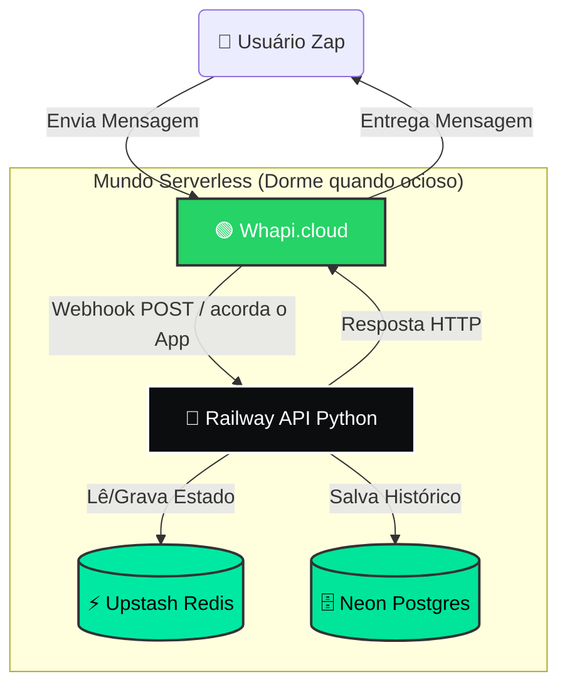
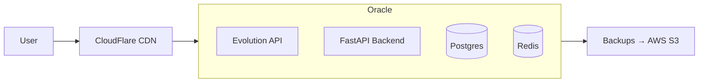

# 💸 Projeto Muquirana: Arquitetura Serverless de Custo Zero


---

## 📖 Índice

1. [Filosofia do Projeto](#-filosofia-do-projeto)
2. [Arquitetura Técnica](#️-arquitetura-técnica)
3. [Componentes do Sistema](#-componentes-do-sistema)
4. [Limitações dos Planos Gratuitos](#-limitações-dos-planos-gratuitos)
5. [Custos dos Planos Pagos](#-custos-dos-planos-pagos)
6. [Cenários de Uso e Consumo](#-cenários-de-uso-e-consumo)
7. [Estratégia de Escalonamento](#-estratégia-de-escalonamento)

---

## 🎯 Filosofia do Projeto

> **"Por que pagar servidor ligado 24h se o bot só trabalha 1 minuto por dia?"**

Este projeto utiliza uma **arquitetura Event-Driven** (orientada a eventos). Todos os componentes "dormem" quando não estão em uso, garantindo:

- ✅ Eficiência máxima de recursos
- ✅ Custo zero para projetos iniciais
- ✅ Escalabilidade sob demanda
- ✅ Sustentabilidade financeira para MVPs

---

## 🏗️ Arquitetura Técnica

### Padrão de Comunicação: Webhooks

O sistema opera em modo **Push**, não mantendo conexões abertas (Socket). O fluxo funciona assim:

1. WhatsApp recebe mensagem do usuário
2. Whapi.cloud dispara webhook (POST) para a API
3. Railway "acorda" o container Docker
4. Processa a mensagem, consulta Redis/Postgres
5. Retorna resposta via HTTP
6. Container volta a "dormir" se ficar ocioso

### Diagrama de Fluxo



---

## 🧩 Componentes do Sistema

### 1. 🚂 Railway (Hospedagem + Docker)

**Função:** Hospeda o código Python (FastAPI) em containers Docker.

**Características:**
- **Serverless Mode:** Habilitar flag "Enable Serverless"
- **Scale to Zero:** Container desliga após 10 minutos de inatividade
- **Cold Start:** ~3 segundos para acordar quando recebe requisição
- **Deploy:** Git-based (integração com GitHub/GitLab)

**Tecnologia:**
- Python 3.11+
- FastAPI (framework web assíncrono)
- Uvicorn (servidor ASGI)

---

### 2. ⚡ Upstash Redis (Memória Curta)

**Função:** Banco de dados em memória para estado temporário da conversa.

**Por que usar:**
- Railway tem "amnésia" ao reiniciar containers
- Latência ultra-baixa (<10ms)
- Guarda contexto da conversa (ex: "Usuário está na etapa 2 da enquete")

**Configurações:**
- **TTL (Time To Live):** Chaves expiram após 5 minutos
- **Limpeza automática:** Garbage collection gerenciado
- **Protocolo:** REST API ou Redis native

**Estrutura de dados típica:**
```redis
user:5511999999999:state = "awaiting_vote"
user:5511999999999:step = "2"
user:5511999999999:last_interaction = "1707603600"
```

---

### 3. 🗄️ Neon Postgres (Memória Longa)

**Função:** Banco de dados SQL relacional persistente.

**Por que usar:**
- Armazenamento definitivo (votos, logs, histórico)
- Separação compute/storage (economia inteligente)
- Branching: clonar banco para testes sem custo extra

**Configurações:**
- **Auto-pause:** CPU desliga após 5 minutos sem consultas
- **Connection pooling:** Máximo de 100 conexões simultâneas
- **Backups:** Automáticos (point-in-time recovery 7 dias)

**Schema exemplo:**
```sql
CREATE TABLE votes (
    id SERIAL PRIMARY KEY,
    user_phone VARCHAR(20),
    poll_id INTEGER,
    choice VARCHAR(100),
    created_at TIMESTAMP DEFAULT NOW()
);
```

---

### 4. 🟢 Whapi.cloud (Interface WhatsApp)

**Função:** Gateway para API do WhatsApp Business.

**Por que usar:**
- Sem necessidade de servidor próprio
- Webhooks configuráveis
- Suporta mídia (imagens, áudios, documentos)
- QR Code para autenticação rápida

**Limitações técnicas:**
- Máximo 5 conversas simultâneas (Free Tier)
- Rate limit: 10 mensagens/segundo
- Sessão expira após 24h de inatividade

---

## ⚠️ Limitações dos Planos Gratuitos

### Tabela Comparativa Detalhada

| Serviço | Plano Gratuito | Limite Mensal | Limite Técnico | Consequência do Estouro |
|---------|----------------|---------------|----------------|------------------------|
| **Railway** | $5.00 crédito único | ~500 horas compute* | 8GB RAM, 8 vCPU | ❌ Serviço suspenso até upgrade |
| **Whapi.cloud** | Free Tier | 150 mensagens | 5 conversas simultâneas | ❌ Bot para de responder |
| **Upstash Redis** | Free Forever | 10.000 comandos/dia | 256MB storage | ⏸️ Bloqueia novas conexões (temporário) |
| **Neon Postgres** | Free Forever | Ilimitado | 0.5GB storage, 1 projeto | 🔒 Modo somente leitura |

\* Com Serverless ativo, os $5.00 podem durar meses dependendo do uso.

---

### 🔍 Detalhamento por Serviço

#### Railway - Restrições Críticas

**Plano Free ($5.00 trial):**
- ❌ **NÃO renova mensalmente** - é um crédito único de teste
- ⏱️ Consumo estimado: $0.01/hora com container ativo
- 📊 Com 90% de idle time (serverless): dura ~3-4 meses
- 🚫 Sem domínio customizado (apenas `*.up.railway.app`)
- 🔄 Deploy: ilimitados
- 📦 Build time: máximo 30 minutos

**Triggers de gasto:**
- Container ativo consome créditos
- Egress data (transferência de saída)
- Build time (compilação do Docker)

---

#### Whapi.cloud - Limitações Severas

**Plano Free:**
- 📨 **150 mensagens/mês** (renova)
  - Contam tanto envio quanto recebimento
  - Webhook duplicado conta 2x
- 👥 **5 conversas ativas simultâneas**
  - Usuários além disso entram em fila
- ⏰ **Sessão expira em 24h** de inatividade
  - Precisa escanear QR Code novamente
- 📎 Mídia: máximo 16MB por arquivo

**Contagem de mensagens:**
```
Usuário envia "Oi" = 1 mensagem
Bot responde "Olá!" = 1 mensagem
Total consumido: 2 mensagens
```

**Cálculo de esgotamento:**
- 150 msgs ÷ 2 (ida + volta) = 75 interações completas/mês
- ~2-3 interações/dia para uso sustentável

---

#### Upstash Redis - Limites Generosos

**Plano Free Forever:**
- 🎯 **10.000 comandos/dia** (renova diariamente)
- 💾 **256MB** de armazenamento
- 🌍 Região: US-East ou EU-West (escolher 1)
- ⚡ Max 100 conexões simultâneas

**Consumo típico por interação:**
```
GET user:X:state     = 1 comando
SET user:X:step      = 1 comando  
EXPIRE user:X:state  = 1 comando
Total: ~3 comandos por mensagem
```

**Capacidade real:**
- 10.000 ÷ 3 = ~3.300 mensagens processadas/dia
- Mais que suficiente para fase MVP

---

#### Neon Postgres - Armadilha Oculta

**Plano Free Forever:**
- 💾 **0.5GB** de armazenamento total
  - Inclui índices, logs e WAL
  - Compressão automática ativa
- 🔌 **1 projeto** (mas branches ilimitados)
- ⏸️ **Auto-pause:** 5 minutos de inatividade
- 📊 Compute: 0.25 vCPU compartilhado

**Estimativa de capacidade:**
```sql
-- Tabela de votos (~100 bytes/registro)
0.5GB ÷ 100 bytes = ~5 milhões de registros

-- Com índices e overhead:
Capacidade real: ~2-3 milhões de votos
```

**Atenção:**
- ⚠️ Limite de **100 conexões simultâneas**
- ⚠️ Connection leak causa bloqueio rápido
- ✅ Usar connection pooling (PgBouncer)

---

## 💰 Custos dos Planos Pagos

### Railway - Plano Hobby

| Item | Valor | Observações |
|------|-------|-------------|
| **Mensalidade Base** | $5.00/mês | Sem trial, renovável |
| **Compute** | Incluso até 500h | Serverless conta apenas tempo ativo |
| **RAM** | 8GB máximo | Por serviço |
| **Storage** | 100GB | Volumes persistentes |
| **Egress** | 100GB/mês | Tráfego de saída |
| **Excedente Compute** | +$0.01/hora | Além das 500h |
| **Excedente Egress** | +$0.10/GB | Além dos 100GB |

**Estimativa realista:**
- Bot com 500 msgs/dia: **~$5.00/mês** (dentro do incluso)
- Bot com 2.000 msgs/dia: **~$7.00/mês** (pequeno excedente)

---

### Whapi.cloud - Salto de Preço Abrupto

| Plano | Mensagens/Mês | Conversas Simultâneas | Preço | 💸 Custo por Mensagem |
|-------|---------------|----------------------|-------|---------------------|
| **Free** | 150 | 5 | $0.00 | Grátis |
| **Starter** | 1.000 | 20 | $25.00 | $0.025 |
| **Growth** | 5.000 | 100 | $75.00 | $0.015 |
| **Business** | 20.000 | Ilimitado | $200.00 | $0.010 |

**Análise crítica:**
- ⚠️ **Gap gigante:** De $0 para $25/mês (+16.566%)
- 📊 **Break-even:** Só vale pagar se processar >151 msgs/mês
- 🎯 **Alternativa:** Evolution API (self-hosted, grátis, complexo)

---

### Upstash Redis - Modelo Justo

**Plano Free Forever:**
- 10.000 comandos/dia = **300.000/mês** inclusos
- $0.00/mês fixo

**Plano Pay-as-you-go:**
- **$0.20 por 100.000 comandos**
- Sem mensalidade mínima
- Cobrança proporcional

**Exemplo de conta:**
```
Bot processa 10.000 msgs/mês
Cada msg = 5 comandos Redis (GET, SET, EXPIRE, etc)
Total: 50.000 comandos/mês

Custo: (50.000 ÷ 100.000) × $0.20 = $0.10/mês
```

**Veredito:** Extremamente barato mesmo em escala.

---

### Neon Postgres - Pricing Enganoso

| Plano | Storage | Compute | Projeto | Preço Base |
|-------|---------|---------|---------|-----------|
| **Free** | 0.5GB | 0.25 vCPU | 1 | $0.00 |
| **Launch** | 10GB | 1 vCPU | 10 | $19.00/mês |
| **Scale** | 50GB | 4 vCPU | Ilimitado | $69.00/mês |

**Cobrança adicional (Pay-as-you-go):**
- **Storage extra:** $0.16/GB/mês
- **Compute:** $0.16/hora ativa
- **Egress:** $0.09/GB

**Cenário realista:**
```
Free Tier esgotou (>0.5GB)
Você precisa de 2GB de storage

Opções:
1. Upgrade para Launch: $19/mês (10GB - desperdício)
2. Pay-as-you-go: (2GB - 0.5GB) × $0.16 = $0.24/mês

💡 Decisão: Ativar pay-as-you-go é mais barato!
```

---

## 📊 Cenários de Uso e Consumo

### Cenário 1: MVP Tímido (50 msgs/mês)

**Perfil:**
- 2 mensagens/dia em média
- 1-2 usuários testando
- 90% do tempo ocioso

**Consumo:**

| Serviço | Uso | Status | Custo |
|---------|-----|--------|-------|
| Railway | ~10h ativas | ✅ Dentro do trial | $0.00 |
| Whapi | 50 msgs | ✅ Muito abaixo | $0.00 |
| Upstash | ~150 comandos/dia | ✅ 1.5% do limite | $0.00 |
| Neon | <0.01GB | ✅ Folga total | $0.00 |
| **TOTAL** | - | - | **$0.00/mês** |

**Duração do trial Railway:** ~20 meses (!!)

---

### Cenário 2: Growth Moderado (500 msgs/mês)

**Perfil:**
- ~17 mensagens/dia
- 5-10 usuários ativos
- Horários de pico (almoço/noite)

**Consumo:**

| Serviço | Uso | Status | Custo |
|---------|-----|--------|-------|
| Railway | ~50h ativas | ✅ Trial | $0.00 |
| Whapi | 500 msgs | ❌ **ESTOURO** | $25.00 |
| Upstash | ~1.500 comandos/dia | ✅ 15% do limite | $0.00 |
| Neon | 0.05GB | ✅ 10% do limite | $0.00 |
| **TOTAL** | - | - | **$25.00/mês** |

**Gargalo:** Whapi é o vilão. Migrar para Evolution API economiza $25/mês.

---

### Cenário 3: Escala Real (5.000 msgs/mês)

**Perfil:**
- ~170 mensagens/dia
- 50+ usuários ativos
- Picos de 500 msgs/hora

**Consumo:**

| Serviço | Uso | Status | Custo |
|---------|-----|--------|-------|
| Railway | ~200h ativas | ✅ Hobby | $5.00 |
| Whapi | 5.000 msgs | ❌ Growth | $75.00 |
| Upstash | ~15.000 comandos/dia | ⚠️ 50% acima | $0.30 |
| Neon | 0.2GB | ✅ 40% | $0.00 |
| **TOTAL** | - | - | **$80.30/mês** |

**Otimização necessária:**
- Migration para Evolution API: -$75.00
- **Custo otimizado:** $5.30/mês

---

### Cenário 4: Viral (50.000 msgs/mês)

**Perfil:**
- ~1.700 mensagens/dia
- 500+ usuários diários
- Pressão contínua

**Consumo:**

| Serviço | Uso | Status | Custo Estimado |
|---------|-----|--------|----------------|
| Railway | ~800h | ❌ Excedente | $8.00 |
| Evolution API | Self-hosted | ✅ Oracle Free | $0.00 |
| Upstash | ~150k comandos/dia | ❌ Pago | $9.00 |
| Neon | 1.5GB | ❌ Pago | $2.40 |
| **TOTAL** | - | - | **$19.40/mês** |

**Comparativo:**
- Com Whapi: ~$200/mês
- Com Oracle Cloud total: **$0.00/mês** (complexidade ++++)

---

## 🚀 Estratégia de Escalonamento

### Fase 1: Protótipo (0-100 msgs/mês) ✅ ATUAL

**Stack:**
- Railway (Serverless)
- Whapi Free
- Upstash Free
- Neon Free

**Custo:** $0.00/mês  
**Complexidade:** ⭐ Baixa  
**DX (Developer Experience):** ⭐⭐⭐⭐⭐ Excelente

---

### Fase 2: Validação (100-500 msgs/mês)

**Mudanças:**
- Migrar Whapi → **Evolution API** (Docker local)
- Manter Railway Serverless
- Upstash/Neon Free ainda suficientes

**Custo:** $0.00/mês (se rodar Evolution em máquina própria)  
**Complexidade:** ⭐⭐⭐ Média  
**Economia:** -$25/mês vs pagar Whapi

**Requisitos técnicos:**
- Servidor com Docker (PC pessoal ou Raspberry Pi)
- IP público ou ngrok/CloudFlare Tunnel
- Conhecimento de redes (port forwarding)

---

### Fase 3: Growth (500-10.000 msgs/mês)

**Stack:**
- Railway Hobby ($5/mês)
- Evolution API (self-hosted)
- Upstash Pay-as-you-go
- Neon Free → Launch se necessário

**Custo estimado:** $5-15/mês  
**Complexidade:** ⭐⭐⭐ Média  
**Foco:** Monitoramento de métricas (DataDog/Prometheus)

---

### Fase 4: Escala (10.000+ msgs/mês)

**Mudanças críticas:**
- Migrar Railway → **Oracle Cloud Free Tier**
  - 4 vCPU ARM
  - 24GB RAM
  - **Grátis vitalício**
- Evolution API + Backend no mesmo VM
- Considerar Neon Scale ou migrar para Postgres managed Oracle

**Custo:** $0-10/mês (dependendo de serviços auxiliares)  
**Complexidade:** ⭐⭐⭐⭐⭐ Muito Alta  
**Barreira:** Configuração manual Linux, networking, segurança

---

### Fase 5: Endgame (100.000+ msgs/mês)

**Arquitetura de produção:**



**Stack:**
- Tudo self-hosted em Oracle Cloud
- CloudFlare para CDN/DDoS protection (Free)
- Backups em AWS S3 (alguns centavos/mês)

**Custo total:** $0-20/mês  
**Complexidade:** ⭐⭐⭐⭐⭐ Extrema  
**ROI:** Economia de $500+/mês vs soluções managed

---

## 🎯 Tabela Resumo: Quando Migrar

| Métrica | Fase Atual | Ação Necessária | Economia/Benefício |
|---------|-----------|-----------------|-------------------|
| > 150 msgs/mês | Whapi Free | Migrar Evolution API | -$25/mês |
| > 500h compute/mês | Railway Trial | Upgrade Hobby | +$5/mês |
| > 10k comandos/dia | Upstash Free | Ativar Pay-as-you-go | ~$0.20/mês |
| > 0.5GB storage | Neon Free | Pay-as-you-go | ~$0.16/GB |
| > 5.000 msgs/mês | Railway | Oracle Cloud | -$5/mês |

---

## 📌 Recomendações Finais

### Para Começar (Hoje):
1. ✅ Use a stack atual (tudo Free Tier)
2. ✅ Configure métricas desde o dia 1
3. ✅ Documente todas as configurações

### Primeira Otimização (Quando bater 150 msgs):
1. 🔄 Migrar para Evolution API
2. 📊 Monitorar uso de Redis
3. 💾 Implementar limpeza de dados antigos no Postgres

### Preparação para Escala:
1. 📚 Estudar Oracle Cloud antes de precisar
2. 🐳 Dockerizar tudo para facilitar migração
3. 📊 Configurar alertas de limite (email quando atingir 80% do Free Tier)

---

## 🔗 Links Úteis

- [Railway Docs](https://docs.railway.app)
- [Whapi.cloud Pricing](https://whapi.cloud/pricing)
- [Upstash Pricing](https://upstash.com/pricing)
- [Neon Pricing](https://neon.tech/pricing)
- [Evolution API GitHub](https://github.com/EvolutionAPI/evolution-api)
- [Oracle Cloud Free Tier](https://www.oracle.com/cloud/free/)

---

**Documentação mantida por:** Projeto Report-Bot  
**Última atualização:** Fevereiro 2025  
**Licença:** MIT